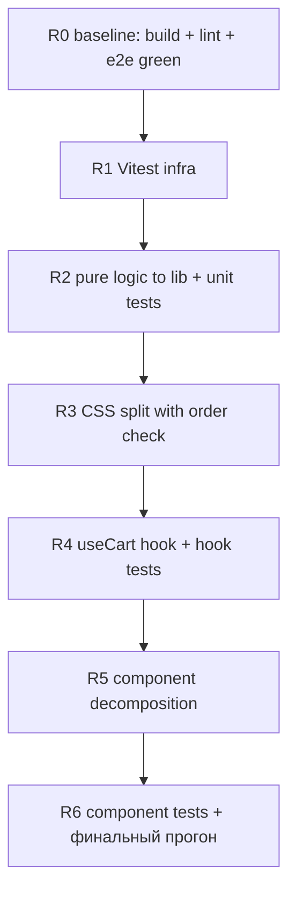

# Rider Kitchen — план «причёсывания» кода и юнит-тестов

Цель: разбить разросшиеся файлы на явные модули, вынести чистую логику
и покрыть её юнит-тестами — **не меняя визуал и DOM-структуру**, на
которые завязаны e2e-тесты. Страховка: [`tests/`](../tests) — 26
e2e-тестов зелёные; критерий приёмки каждого шага — зелёные
`npm run build`, `npm run lint`, `npm run test:e2e` (+ `vitest run`
после его появления).

Правила проекта — в [`AGENTS.md`](../AGENTS.md), общий план — в
[`PLAN.md`](PLAN.md). Этот план — снапшот анализа от 2026-09, размеры
файлов указаны на его момент.

## Принципы и ограничения

- Без стейт-менеджеров, роутеров, UI-библиотек (жёсткое правило
  `AGENTS.md`). Хук корзины — обычный кастомный хук на `useState`.
- **Контракт e2e-селекторов не трогаем** (см. раздел ниже): имена
  классов, `aria-label`, `#cart-phone`, `#sets`, структура
  `<section class="menu-section">`.
- Компонент — только при переиспользовании 2+ раза или явной смысловой
  единице. Логика — другое дело: чистые функции в `src/lib/` и хуки в
  `src/hooks/` правилам не противоречат.
- Каждый шаг рефакторинга — отдельный коммит, конец шага = полный
  зелёный прогон проверок. Шаги между собой не смешивать.

## Что показал анализ (замеры файлов)

| Файл | Строк | Оценка |
| --- | --- | --- |
| `src/App.css` | 1234 | Крупнейший файл; 9 смысловых блоков, порядок критичен |
| `src/content/menu.ts` | 508 | Контент — так и задумано, не трогать |
| `src/components/CartDrawer.tsx` | 238 | Перерос: drawer + скрытый PDF-лист + чистая логика заказа |
| `src/App.tsx` | 143 | 3 несвязанные ответственности (см. ниже) |
| `src/components/Header.tsx` | 86 | Норма |
| `src/components/FontDebugToggle.tsx` | 82 | Норма (дебаг-инструмент) |
| `src/components/PriceStepper.tsx` | 67 | Норма |
| `src/lib/exportPdf.ts` | 66 | Норма, чистая изолированная единица |
| `src/components/SetsSection.tsx` | 63 | Частичное дублирование DishCard |
| `src/components/DishCard.tsx` | 52 | Норма |
| `src/components/Hero.tsx` | 47 | Норма |
| `src/components/MenuSection.tsx` | 40 | Норма |
| `src/lib/format.ts` | 42 | Норма, идеальный кандидат на юнит-тесты |
| `src/components/Footer.tsx` | 19 | Норма |
| `src/index.css` | 159 | Токены/шрифтовые варианты/ресет — не трогать |

Вывод: по-настоящему «горячие» точки — три: `App.css` (1234),
`CartDrawer.tsx` (238), `App.tsx` (143). Остальное в здоровом
состоянии, трогать не нужно.

## Найденные проблемы

1. **`src/App.tsx` смешивает три ответственности**:
   - компонент `ThemeDebugToggle` зашит прямо в файл (строки 18–32) —
     при том что его собрат `FontDebugToggle` живёт отдельным файлом;
   - справочник `DISH_BY_KEY` (строки 37–69) — чистая функция над
     контентом, от которой зависят и корзина, и PDF/WhatsApp-тексты;
   - логика корзины (`handleQtyChange`, `cartItems`, `cartTotal`,
     `cartCount`) — строки 75–100, не имеет ни строки тестов.
2. **`CartDrawer.tsx` (238 строк)** делает всё сразу: overlay/drawer,
   маску и валидацию телефона, сборку текста WhatsApp-заказа
   (`orderText`, строки 37–44), разбивку по разделам (`sectionSummary`,
   строки 47–52) и постоянно отрендеренный скрытый PDF-лист (строки
   173–235). Чистая логика заказа — кандидат в `src/lib/` и юнит-тесты;
   PDF-лист — отдельная смысловая единица.
3. **`src/App.css` — 1234 строки** без внутренней навигации. Известный
   баг проекта (порядок `@media (max-width: 520px)` после безусловных
   правил — см. `AGENTS.md`, `docs/CHANGELOG.md`) держится только на
   человеческой дисциплине: в файле сложно видеть, что после чего идёт.
4. **Дублирование карточек**: `SetsSection` повторяет анатомию
   `DishCard` (фото → имя → футер с калоражем и степпером), заимствуя
   чужие классы (`dish-card__image`, `dish-card__name`,
   `dish-card__footer`, `dish-card__kcal`) внутри `set-card`. Работает,
   но неочевидно; правки карточек надо делать в двух местах.
5. **Повтор рецепта «пилюли»** (`border-radius: 999px` + `border` +
   `background: var(--surface)`) в `.header__cart`, `.hero__kicker`,
   `.hero__badge`, `.debug-toggle`, `.dish-tag` — косметика, к
   рефакторингу прямого отношения не имеет (см. «Что НЕ делаем»).
6. **Нет юнит-слоя вообще**: вся чистая логика (`format.ts`,
   `exportPdf.ts`, каталог, текст заказа) проверяется только e2e через
   браузер — медленно и грубо для таких функций, как
   `formatPhoneRu`/`pluralizeRu`.

## Контракт e2e-селекторов (не ломать)

Из [`tests/cart.spec.ts`](../tests/cart.spec.ts),
[`tests/responsive.spec.ts`](../tests/responsive.spec.ts),
[`tests/support.ts`](../tests/support.ts):

- классы: `.header__bar`, `.header__cart`, `.header__cart-total`,
  `.header__cart-badge`, `.hero__inner`, `.hero__media img`,
  `.menu-section`, `.dish-card`, `.dish-card__name`,
  `.dish-card__image`, `.price-pill*`, `.price-stepper`,
  `.cart-overlay`, `.cart-drawer`, `.cart-drawer__*`, `.cart-item*`,
  `.footer`;
- id: `#cart-phone`, `#sets`, секции меню `id="<id категории>"`;
- aria-атрибуты: `Добавить «X» в заказ`, `Добавить порцию`, `Убрать
  порцию`, `Открыть корзину: …`, `aria-disabled` на «Сформировать
  заказ», `role="dialog"`;
- поведение: `qty <= 0` удаляет ключ из Map, имя PDF-файла
  `rider-kitchen-order.pdf`, формат текста WhatsApp-заказа.

Любой рефакторинг, меняющий эти точки, = правки e2e-тестов в том же
шаге. Цель плана — таких правок избежать.

## Целевая структура модулей

```
src/
  components/
    Header.tsx            # 86 — без изменений
    Hero.tsx              # 47 — без изменений
    Footer.tsx            # 19 — без изменений
    MenuSection.tsx       # 40 — без изменений
    DishCard.tsx          # 52 — без изменений
    SetsSection.tsx       # 63 — без изменений (см. «Что НЕ делаем»)
    PriceStepper.tsx      # 67 — без изменений
    CartDrawer.tsx        # 238 → ~165: остаётся только drawer
    CartPdfSheet.tsx      # новый ~75: скрытый PDF-лист (смысловая единица)
    ThemeDebugToggle.tsx  # новый ~30: переезд из App.tsx (рядом с FontDebugToggle)
    FontDebugToggle.tsx   # 82 — без изменений
  hooks/
    useCart.ts            # новый ~55: стейт корзины из App.tsx
  lib/
    format.ts             # 42 — без изменений
    exportPdf.ts          # 66 — без изменений
    catalog.ts            # новый ~45: DISH_BY_KEY из App.tsx (чистая функция)
    order.ts              # новый ~40: orderText, sectionSummary, whatsappHref
  content/                # без изменений
  styles/                 # партиалы App.css (см. схему ниже)
  App.tsx                 # 143 → ~60: только композиция + useCart
```

Итог: ни один `.tsx` не превышает ~170 строк, вся нетривиальная логика —
в `lib/`/`hooks/` и покрыта юнит-тестами.

## Схема разбиения CSS (с гарантией порядка каскада)

**Подход: `src/App.css` становится агрегатором `@import` — партиалы в
`src/styles/`, подключённые строго в порядке блоков исходного файла.**
Vite инлайнит CSS-`@import` на этапе сборки с сохранением порядка
(postcss-import), поэтому порядок каскада = порядок `@import` = прежний
порядок строк файла 1-в-1.

```css
/* src/App.css — ТОЛЬКО @import, порядок менять запрещён.
   Каскад зависит от порядка подключения (баг 520px — AGENTS.md). */
@import './styles/header.css';
@import './styles/debug.css';
@import './styles/hero.css';
@import './styles/buttons.css';
@import './styles/menu.css';
@import './styles/cards.css';
@import './styles/footer.css';
@import './styles/cart.css';
@import './styles/pdf.css';
```

Маппинг строк исходного `App.css` на партиалы:

| Партиал | Строки | Содержимое |
| --- | --- | --- |
| `styles/header.css` | 5–236 | `.header*`, burger, media 720/1099/360 |
| `styles/debug.css` | 238–287 | `.debug-toolbar*`, `.debug-toggle*` |
| `styles/hero.css` | 289–394 | `.hero*`, media 880 |
| `styles/buttons.css` | 396–445 | `.button*` |
| `styles/menu.css` | 447–520 | `main`, `.menu-section*`, media 1800, note |
| `styles/cards.css` | 522–804 | `.dish-card*`, `.set-card*`, `.price-pill*`, media 520/360, tags |
| `styles/footer.css` | 806–832 | `.footer*` |
| `styles/cart.css` | 834–1047 | overlay, `.cart-drawer*`, `.cart-item*` |
| `styles/pdf.css` | 1049–1234 | `.pdf-sheet*`, `.pdf-row*` |

Гарантии и правила:

- Внутри партиала срез вырезается **подряд, без перестановок** — тогда
  все `@media`-блоки сохраняют позицию относительно своих базовых
  правил (критичный кейс: media 520/360 в `cards.css` остаются после
  безусловных `.price-pill*` — это тот самый баг из `AGENTS.md`).
- Файл-агрегатор и каждый партиал получают комментарий-предупреждение
  о зависимости порядка (по образцу комментария в `playwright.config.ts`).
- **Проверка 1-в-1**: до разбиения снять `vite build`, сохранить
  содержимое `dist/assets/*.css`; после разбиения пересобрать и
  сравнить (diff/hash). Отличие допустимо только на конкатенацию
  (порядок правил — байт-в-байт).
- `src/index.css` не трогаем (импортируется в `main.tsx` до `App.css`,
  относительный порядок токенов и компонентов сохраняется).

**Почему НЕ «css рядом с компонентом»**: при импорте CSS из `.tsx`
порядок в бандле следует за порядком исполнения модульного графа
(порядок `import` в `App.tsx`), а не за порядком файлов на диске.
Это тонкая зависимость, которую легко молча сломать перестановкой
импортов. Агрегатор делает порядок явным и проверяемым.

## Юнит-стек: Vitest (+ Testing Library по минимуму)

**Выбор: Vitest + jsdom, для хука/компонентов — @testing-library/react
и @testing-library/user-event.**

Обоснование:

- **Нативен для Vite**: тот же transform-пайплайн и разрешение
  импортов, что и в проде; конфиг добавляется в `vite.config.ts`
  (`/// <reference types="vitest/config" />` + поле `test`), отдельный
  раннер и его конфиг не нужны.
- **TS из коробки**: явные `import { describe, it, expect } from 'vitest'`
  — без глобальных типов и без правки `types` в app-конфигах.
- **Jest отклонён**: требует свой ts-config/transform-слой поверх Vite
  (ts-jest/babel) — лишняя движущаяся часть при уже работающем Vite.
- **oxlint**: конфликтов нет — тесты пишутся как обычные TS-модули,
  глобалы Vitest не используются; правило
  `react/only-export-components` ещё и выигрывает: хук переезжает из
  `App.tsx` в `src/hooks/useCart.ts`, файл снова «только компоненты».
- **`build = tsc -b` не ломается**: юнит-тесты кладём в `tests/unit/`
  (вне `include: ["src"]` у `tsconfig.app.json`) и подключаем новым
  `tsconfig.unit.json` **по образцу существующего
  [`tsconfig.e2e.json`](../tsconfig.e2e.json)** (те же флаги 1-в-1 +
  `"jsx": "react-jsx"` для `.tsx`), добавив в `references` корневого
  `tsconfig.json`. Тесты начинают проверяться типами на `npm run build`
  — так же, как это уже работает для e2e.
- **jsdom**: подключается глобально (`test.environment: 'jsdom'`) —
  для масштаба проекта оверхед нулевой, зато хук- и компонентные тесты
  работают без docblock-магии. Чистые функции от этого не страдают.
- **jest-dom не добавляем**: минимальность зависимостей важнее
  сахарных матчеров; хватает `expect(...).toBeTruthy()`, `toBe`,
  `toBeInTheDocument` заменяется обычными проверками.

`package.json`:

```json
"scripts": {
  "test": "vitest run",
  "test:watch": "vitest"
}
```

devDependencies: `vitest`, `jsdom`, `@testing-library/react`,
`@testing-library/user-event`.

Минимальный разумный набор тестов (компонентов мало, они простые —
больше не нужно):

| Файл | Что проверяет | Тип |
| --- | --- | --- |
| `tests/unit/format.test.ts` | `formatPrice`, `pluralizeRu` (11–14, 1, 2–4, прочие), `formatPhoneRu` (8-ка, 9-ка, обрезка), `isPhoneRuComplete` | чистые функции |
| `tests/unit/catalog.test.ts` | каждая позиция `menu` и `sets` находит по ключу `"<id>:<название>"`, поля совпадают с контентом | чистые функции |
| `tests/unit/order.test.ts` | текст заказа (позиции, итого, телефон), разбивка по разделам, WhatsApp-href с `encodeURIComponent` | чистые функции |
| `tests/unit/useCart.test.tsx` | добавление/инкремент/декремент до нуля удаляет ключ, `clear`, итог и счётчик — через `renderHook` + `act` | хук |
| `tests/unit/PriceStepper.test.tsx` | клик по пилюле → `onQtyChange(1)`, «+»/«−» зовут колбэк, `aria-label` соответствуют контракту e2e | компонент |

## Что НЕ делаем (сознательно)

- **Не вводим CSS-утилити-классы для «пилюль»** (`.header__cart`,
  `.hero__kicker`, `.dish-tag` и пр.): визуал не тестируется
  скриншотами, выгода косметическая, риск регрессии реальный. Рецепт
  и так единый через CSS-переменные.
- **Не унифицируем `set-card` под `DishCard`** (общий компонент
  карточки): ради этого пришлось бы менять классы/DOM, на которые
  пусть и не смотрит e2e напрямую, но смотрит визуал. Оставляем как
  есть; пункт можно пересмотреть после презентации владельцу.
- **Не трогаем `src/content/`** — контентная зона, не код.
- **Не удаляем дебаг-инструменты** — только переехать
  `ThemeDebugToggle` в свой файл; решение об удалении — перед
  презентацией (см. `AGENTS.md`).
- Никаких стейт-менеджеров, роутеров, UI-библиотек (жёсткое правило).

## Порядок шагов

Логика последовательности: сначала инфраструктура тестов и чистые
функции (нулевая связь с DOM → минимальный риск), затем CSS (механика
с точной проверкой), затем стейт/компоненты — уже под двойной
страховкой e2e + юниты.



### R0 — базовая линия

- [ ] Зафиксировать зелёные `npm run build`, `npm run lint`,
      `npx playwright test` (26 passed) на текущем `main`.
- [ ] Снять эталонный CSS-бандл: `vite build` → сохранить
      `dist/assets/*.css` для сверки шага R3.

### R1 — инфраструктура Vitest

- [ ] `npm i -D vitest jsdom @testing-library/react @testing-library/user-event`.
- [ ] `vite.config.ts`: reference `vitest/config` + `test`-блок
      (`environment: 'jsdom'`, `include: 'tests/unit/**/*.test.{ts,tsx}'`).
- [ ] `tsconfig.unit.json` по образцу `tsconfig.e2e.json`
      (включая `strict`) + `"jsx": "react-jsx"`, `include:
      ["tests/unit"]`; добавить в `references` корневого `tsconfig.json`.
- [ ] Скрипты `test` / `test:watch` в `package.json`.
- [ ] Пустой smoke-тест `tests/unit/smoke.test.ts` → `vitest run`
      зелёный; `npm run build` зелёный (тесты типируются в `tsc -b`).

### R2 — чистая логика в `src/lib/` + юнит-тесты

- [ ] `src/lib/catalog.ts`: перенос `DISH_BY_KEY` из `App.tsx`
      (экспорт `buildDishIndex()` или готовой константы; тип значения —
      `Omit<CartItem, 'id' | 'qty'>` из `src/content/types.ts`).
- [ ] `src/lib/order.ts`: перенос `orderText`, `sectionSummary`,
      `whatsappHref` из `CartDrawer.tsx` (чистые функции:
      `buildOrderText(items, total, phone)`, `buildSectionSummary(items)`,
      `buildWhatsAppHref(phone, text)`).
- [ ] `App.tsx` / `CartDrawer.tsx` переводятся на импорты; DOM и тексты
      не меняются.
- [ ] Юнит-тесты: `format.test.ts`, `catalog.test.ts`, `order.test.ts`.
- [ ] Прогон: build + lint + vitest + e2e зелёные.

### R3 — разбиение `App.css` на партиалы

- [ ] Создать `src/styles/*.css` срезами по таблице выше,
      `src/App.css` → агрегатор `@import` с предупреждением о порядке.
- [ ] Сверка: `vite build` → diff CSS-бандла с эталоном R0
      (только конкатенация, порядок правил байт-в-байт).
- [ ] Прогон: build + lint + e2e зелёные (особенно responsive-сценарии
      переполнений на 320/375 — они ловят каскадные регрессии).

### R4 — хук корзины

- [ ] `src/hooks/useCart.ts`: стейт `Map`, `handleQtyChange`,
      `cartItems` (memo), `cartTotal`, `cartCount`, `clear`; зависит от
      `catalog.ts`.
- [ ] `App.tsx` использует `useCart` — компонентная часть без изменений.
- [ ] Юнит-тест `useCart.test.tsx` через `renderHook` + `act`.
- [ ] Прогон: build + lint + vitest + e2e зелёные.

### R5 — декомпозиция компонентов

- [ ] `src/components/ThemeDebugToggle.tsx`: переезд из `App.tsx`
      1-в-1 (рядом с `FontDebugToggle`), разметка `.debug-toolbar`
      не меняется.
- [ ] `src/components/CartPdfSheet.tsx`: скрытый PDF-лист (строки
      173–235 `CartDrawer.tsx`) → отдельный компонент с пропсами
      `items`, `total`, `phone`; ref на `.pdf-sheet__page` возвращается
      через проп-колбэк или `forwardRef` — так, чтобы `exportElementToPdf`
      вызывался из `CartDrawer` как сейчас.
- [ ] Проверка: имена классов и структура DOM обоих кусков не изменились
      (e2e-сценарии PDF и корзины зелёные без правок).
- [ ] Прогон: build + lint + vitest + e2e зелёные.

### R6 — компонентные тесты и финал

- [ ] `tests/unit/PriceStepper.test.tsx` (контракт `aria-label` и
      колбэков — страховка от случайной поломки e2e-селекторов).
- [ ] Обновить `docs/CHANGELOG.md` краткой записью о рефакторинге.
- [ ] Финальный полный прогон: build + lint + vitest + e2e (26 passed).

## Критерий приёмки

- `npm run build` — зелёный (включая типизацию тестов через `tsc -b`).
- `npm run lint` — зелёный.
- `npm run test` (vitest) — зелёный, ≥ 20 юнит-тестов.
- `npm run test:e2e` — 26 passed, правок в `tests/` не требуется.
- CSS-бандл после R3 отличается от эталонного только конкатенацией.
- Ни один файл проекта не превышает ~170 строк (кроме контента в
  `src/content/menu.ts`).
